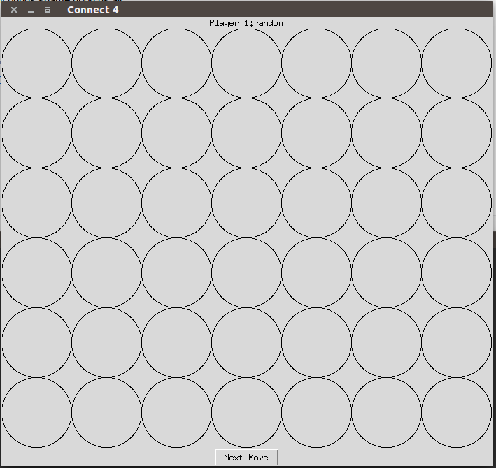
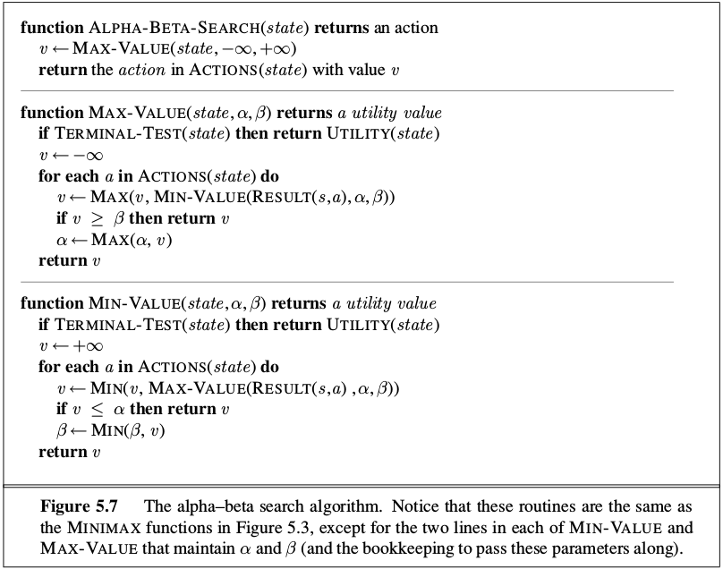
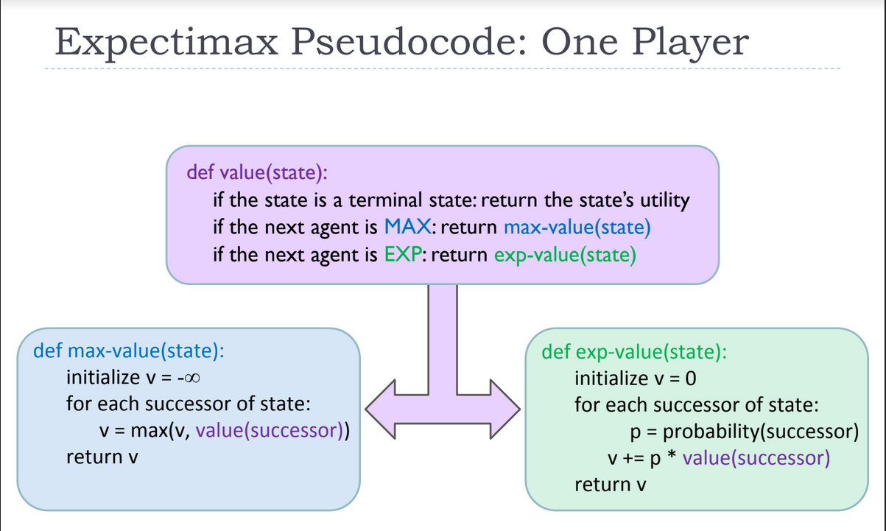

# Assignment 3

**Due 5/20/2018 at 11:59pm**

### Description

In this assignment you will implment an agent to play the game of Connect 4.
Your agent will use the **alpha-beta search algorithm**
and the **expectimax search algorithm** to select the
next move given the current board state.

There are two main files:
- ConnectFour.py
- Player.py

ConnectFour.py contains the all of the functions of the game.
Player.py contains all of the types of players that can participate in the
game:
- AIPlayer (Your Implementation)
- RandomPlayer (Chooses from valid columns with equal probability)
- HumanPlayer (You)

You need to implement **all** of the following:

`def get_alpha_beta_move(self, board)`

and

`def get_expectimax_move(self, board)`

and

`def evaluation_value(self, board)`

These functions serve as a high level abstraction for interacting with a player.
You will likely need to implement other functions in the class to make your code
modular and readable. **Note that it will likely be too expensive to explore the
entire game tree at the beginning of the game so a depth-limited search is a
good place to start**.

To play the game run the following command:

`python ConnectFour.py arg1 arg2`

Where `arg1` and `arg2` are one of `ai`, `random`, or `human`

For example if you wanted to play against a random player you would run:

`python ConnectFour.py human random`

**Note: A human player has to enter their move into the terminal**

If you wanted your ai to play itself you would run:

`python ConnectFour.py ai ai`

`ConnectFour.py` takes one optional argument `--time` that is an integer. It is
the value used to limit the amount of time in seconds to wait for the AI player
to make a move. The default value is 5 seconds.

Here is the award winning GUI that comes included:

The top text displays the player who's move it is.

The well drawn circles in the middle are the places places on the gameboard

The next move button does exactly what your expect, it moves the game forward
by one move.

When the game is over the top text will change to the name of the winning player
and 'wins!'

Shown below is an example where I managed to get the best of a Random player:

### Deliverables

You will to turn in 2 files:

- Player.py
  - This should include your **alpha-beta search algorithm**
  and **expectimax search** implemenations int the AIPlayer
  class

- Assignment3.pdf
  - Address the following questions:
    - What heuristic did you use? Why?
    - Describe how your algorithm performs given different time contraints.
    How much of the tree can you explore given 5 seconds per turn? 10 seconds?
    3 seconds?
    - Can you beat your algorithm?
    - If your algorithm plays itself, does the player that goes first do better
    or worse in general? Share some of the results.

### Relevant Resources
**Alpha-Beta**

**Expectimax**

